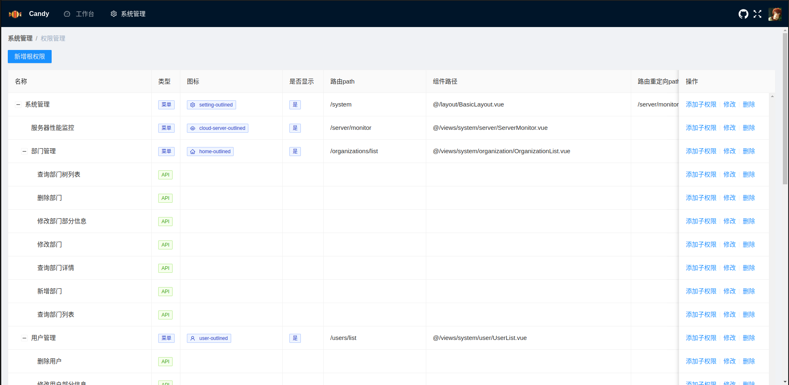
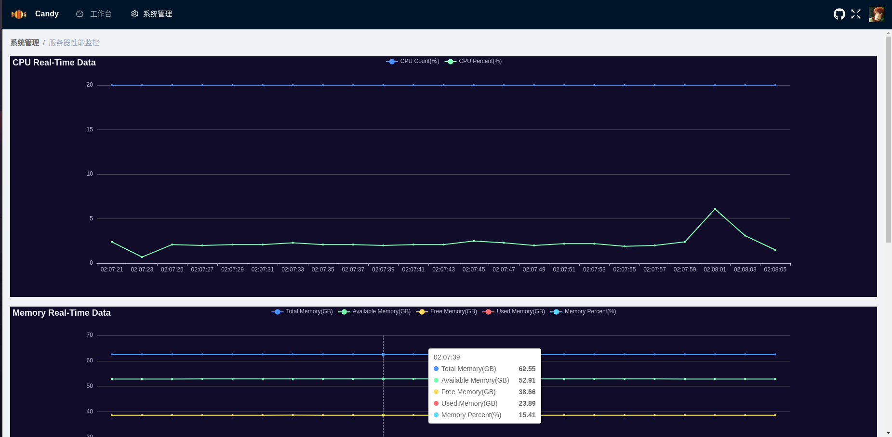

# Candy - 基于Django3.2 + Vue3 + MySQL8 可进行二次开发的Admin脚手架

权限控制基于RBAC，精确到菜单和按钮级别权限控制。

## 技术栈

### 后端
```text
Django==3.2.16
django-environ==0.9.0
django-filter==22.1
djangorestframework==3.14.0
djangorestframework-simplejwt==5.2.2
drf-spectacular==0.25.1
mysqlclient==2.1.1
Pillow==9.3.0
channels==4.0.0
daphne==4.0.0
psutil==5.9.4
```
### 数据库
MySQL 8.0.30
### 前端
```json
{
   "dependencies": {
    "@ant-design/icons-vue": "^6.1.0",
    "ant-design-vue": "^3.2.15",
    "axios": "^0.27.2",
    "dayjs": "^1.11.7",
    "echarts": "^5.4.1",
    "monaco-editor": "^0.34.1",
    "nprogress": "^0.2.0",
    "path-browserify": "^1.0.1",
    "pinia": "^2.0.28",
    "screenfull": "^6.0.2",
    "vue": "^3.2.45",
    "vue-echarts": "^6.3.3",
    "vue-router": "^4.1.6"
  },
  "devDependencies": {
    "@rushstack/eslint-patch": "^1.2.0",
    "@vitejs/plugin-vue": "^3.2.0",
    "@vue/eslint-config-prettier": "^7.0.0",
    "eslint": "^8.30.0",
    "eslint-plugin-vue": "^9.8.0",
    "less": "^4.1.3",
    "less-loader": "^11.1.0",
    "prettier": "^2.8.1",
    "vite": "^3.2.5"
  }
}
```

## 本地开发环境搭建
```shell
virtualenv venv
source venv/bin/activate
pip3 install -i https://pypi.doubanio.com/simple -U pip
pip3 install -i https://pypi.doubanio.com/simple -r requirements.txt
# 使用docker快速启动一个MySQL8容器并设置密码为123456，并持久化数据到本地/home/hashqueue/mysqldatadir
docker run --name mysql8 -p 3306:3306 -v /home/hashqueue/mysqldatadir:/var/lib/mysql -e MYSQL_ROOT_PASSWORD=123456 -d mysql:8.0.30
python3 manage.py makemigrations
python3 manage.py migrate
# 开发环境默认会找项目根目录下的.env.dev环境变量文件
python3 manage.py runserver
# 前端开发环境搭建见前端仓库 https://github.com/hashqueue/candy-web.git
#####################################################
###               Done!下边的命令了解即可            ###
#####################################################
# 生产环境使用开发服务器启动时手动指定读取哪个env文件(项目根目录下的.env.prod)
ENV_PATH=.env.prod python3 manage.py runserver
# Django导出数据库数据
python3 manage.py dumpdata --format json --indent 2 -o init_db.json
# Django导入已有的数据到新的数据库中
python3 manage.py loaddata init_db.json
# 开发环境下使用daphne启动项目
daphne -b 0.0.0.0 -p 8000 candy.asgi:application
# 生产环境下使用daphne启动项目
ENV_PATH=.env.prod daphne -b 0.0.0.0 -p 8000 candy.asgi:application
```

## 生产环境部署

1. 安装docker和docker-compose和git
    * [docker安装步骤(官方文档)](https://docs.docker.com/engine/install/)
    * [docker-compose安装步骤(官方文档)](https://docs.docker.com/compose/install/)
    * [git安装步骤(官方文档)](https://git-scm.com/download/linux)
2. git拉取本项目代码到服务器
    ```shell
    # 下载后端源码
    git clone https://github.com/hashqueue/candy.git
    cd candy
    # 下载前端源码
    git clone https://github.com/hashqueue/candy-web.git
    cd .. # 回到后端代码目录
    ```
3. docker-compose启动项目(前端，后端，数据库)
    ```shell
    # 部署并启动项目
    docker-compose --env-file=./.env.prod up -d
    # 容器全部启动成功后，手动进入backend容器，初始化数据库数据(此步骤仅第一次部署项目时需要操作！！！)。
    docker exec -it backend /bin/bash # 进入backend容器
    ENV_PATH=.env.prod python3 manage.py loaddata init_db.json # 初始化数据库数据
    ```
项目部署成功后访问`http://服务器域名或IP/`即可跳转到登录页面

## 截图

swagger格式接口文档 `http://服务器域名或IP/api/v1/swagger/`


redoc格式接口文档 `http://服务器域名或IP/api/v1/redoc/`


登录页


系统首页


权限管理



角色管理


用户管理


部门管理


服务器性能监控



个人中心


